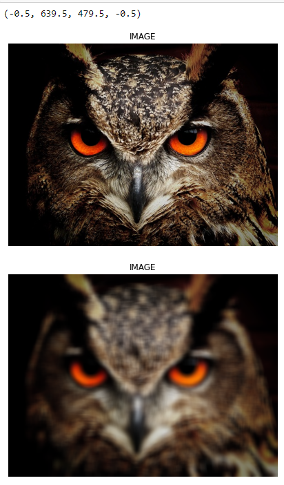
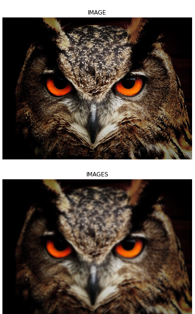
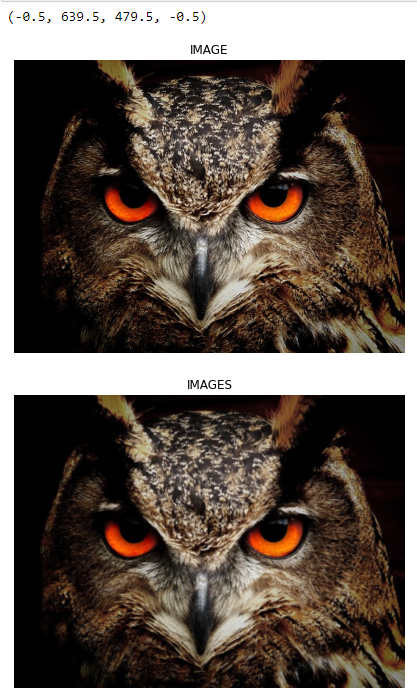

# Implementation-of-Filters
## Aim:
To implement filters for smoothing and sharpening the images in the spatial domain.

## Software Required:
Anaconda - Python 3.7

## Algorithm:
### Step 1:

Import cv2, matplotlib.py libraries and read the saved images using cv2.imread().

### Step 2:

Convert the saved BGR image to RGB using cvtColor().

### Step 3:

By using the following filters for image smoothing:filter2D(src, ddepth, kernel), Box filter,Weighted Average filter,GaussianBlur(src, ksize, sigmaX[, dst[, sigmaY[, borderType]]]), medianBlur(src, ksize),and for image sharpening:Laplacian Kernel,Laplacian Operator.

### Step 4:

Apply the filters using cv2.filter2D() for each respective filters.

### Step 5:

Plot the images of the original one and the filtered one using plt.figure() and cv2.imshow().

## Program:
```
### Developed By   : Shyam Kumar A 
### Register Number: 212221230098
```

### 1. Smoothing Filters

i) Using Averaging Filter
```Python
import cv2
import numpy as np
import matplotlib.pyplot as plt
img1 = cv2.imread('bird.jpg')
img2 = cv2.cvtColor(img1,cv2.COLOR_BGR2RGB)
kernel = np.ones((15,15),np.float32)/225
img3 = cv2.filter2D(img2,-1,kernel)
plt.figure(figsize = (7,7))
plt.imshow(img2)
plt.title("IMAGE")
plt.axis('off')
plt.figure(figsize = (7,7))
plt.imshow(img3)
plt.title("IMAGE")
plt.axis('off')


```
ii) Using Weighted Averaging Filter
```Python
import cv2
import numpy as np
import matplotlib.pyplot as plt
img1 = cv2.imread('bird.jpg')
img2 = cv2.cvtColor(img1,cv2.COLOR_BGR2RGB)
kernel2 = np.array([[1,2,1],[2,4,2],[1,2,1]])/16
img4 = cv2.filter2D(img2,-1,kernel2)
plt.figure(figsize = (7,7))
# plt.subplot(1,2,1)
plt.imshow(img2)
plt.title("IMAGE")
plt.axis('off')
plt.figure(figsize=(7,7))
#plt.subplot(10,20,20)
plt.imshow(img4)
plt.title("IMAGES")
plt.axis('off')


```
iii) Using Gaussian Filter
```Python
import cv2
import numpy as np
import matplotlib.pyplot as plt
img1 = cv2.imread('bird.jpg')
img2 = cv2.cvtColor(img1,cv2.COLOR_BGR2RGB)
gblur = cv2.GaussianBlur(src=img2,ksize = (11,11),sigmaX=0,sigmaY=0)
plt.figure(figsize = (7,7))
# plt.subplot(1,2,1)
plt.imshow(img2)
plt.title("IMAGE")
plt.axis('off')
plt.figure(figsize=(7,7))
plt.imshow(gblur)
plt.title("IMAGES")
plt.axis('off')


```

iv) Using Median Filter
```Python

import cv2
import numpy as np
import matplotlib.pyplot as plt
img1 = cv2.imread('bird.jpg')
img2 = cv2.cvtColor(img1,cv2.COLOR_BGR2RGB)
med = cv2.medianBlur(src = img2,ksize=11)
kernel2 = np.array([[1,2,1],[2,4,2],[1,2,1]])/16
img4 = cv2.filter2D(img2,-1,kernel2)
plt.figure(figsize = (7,7))
# plt.subplot(1,2,1)
plt.imshow(img2)
plt.title("IMAGE")
plt.axis('off')
plt.figure(figsize=(7,7))
#plt.subplot(10,20,20)
plt.imshow(img4)
plt.title("IMAGES")
plt.axis('off')


```

### 2. Sharpening Filters
i) Using Laplacian Kernal
```Python
import cv2
import numpy as np
import matplotlib.pyplot as plt
img1 = cv2.imread('bird.jpg')
img2 = cv2.cvtColor(img1,cv2.COLOR_BGR2RGB)
kernel2 = np.array([[0,1,0],[1,-4,1],[0,1,0]])
img4 = cv2.filter2D(img2,-1,kernel2)
plt.figure(figsize = (7,7))
plt.imshow(img2)
plt.title("IMAGE")
plt.axis('off')
plt.figure(figsize=(7,7))
plt.imshow(img4)
plt.title("IMAGES")
plt.axis('off')


```
ii) Using Laplacian Operator
```Python

import cv2
import numpy as np
import matplotlib.pyplot as plt
img1 = cv2.imread('bird.jpg')
img2 = cv2.cvtColor(img1,cv2.COLOR_BGR2RGB)
lap = cv2.Laplacian(img2,cv2.CV_64F)
plt.figure(figsize = (7,7))
plt.imshow(img2)
plt.title("IMAGE")
plt.axis('off')
plt.figure(figsize = (7,7))
plt.imshow(lap)
plt.title("IMAGE")
plt.axis('off')


```

## OUTPUT:
### 1. Smoothing Filters
</br>

i) Using Averaging Filter



ii) Using Weighted Averaging Filter


iii) Using Gaussian Filter


iv) Using Median Filter


### 2. Sharpening Filters
</br>

i) Using Laplacian Kernal


ii) Using Laplacian Operator


## Result:
Thus the filters are designed for smoothing and sharpening the images in the spatial domain.
